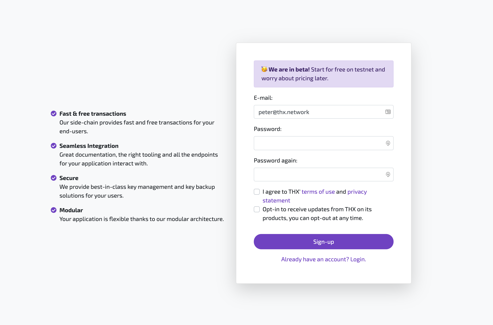

THX API, Dashboard and Web Wallet allow you to **embed fintech features in any application**. This documentation is meant to help you integrate with our API and showcase it's possibilities. 

:::tip
No blockchain or smart contract knowledge is required when integrating with THX API.
:::

## 1. Signup
[Signup for a THX account](https://www.thx.network/signup) to get API access. 

## 2. Create Asset Pool
Make sure to connect an ERC20 token and create your asset pool in [THX Dashboard](https://dashboard.thx.network). 

:::info
[Contact our team on Slack](https://thx.page.link/slack) if you have any questions or need help in the process.
:::