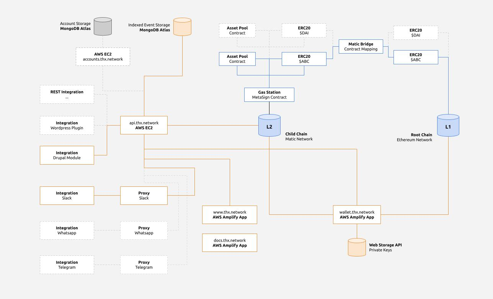

THX API and Web Wallet allow you to **embed fintech features in any application**. This documentation is meant to help you integrate with our API and showcase it's possibilities. 

:::tip
No blockchain or smart contract knowledge is required when integrating with THX API.
:::

If you didn't do so already, [register an account](https://www.thx.network) to obtain your client credentials.

## Network Diagram

The THX ecosystem contains of various parts that help you embed fintech in your application without worrying about security, performance or scalability. A communications diagram is shown below. Get more information about the network in the [network details section](../networks) of the docs.

