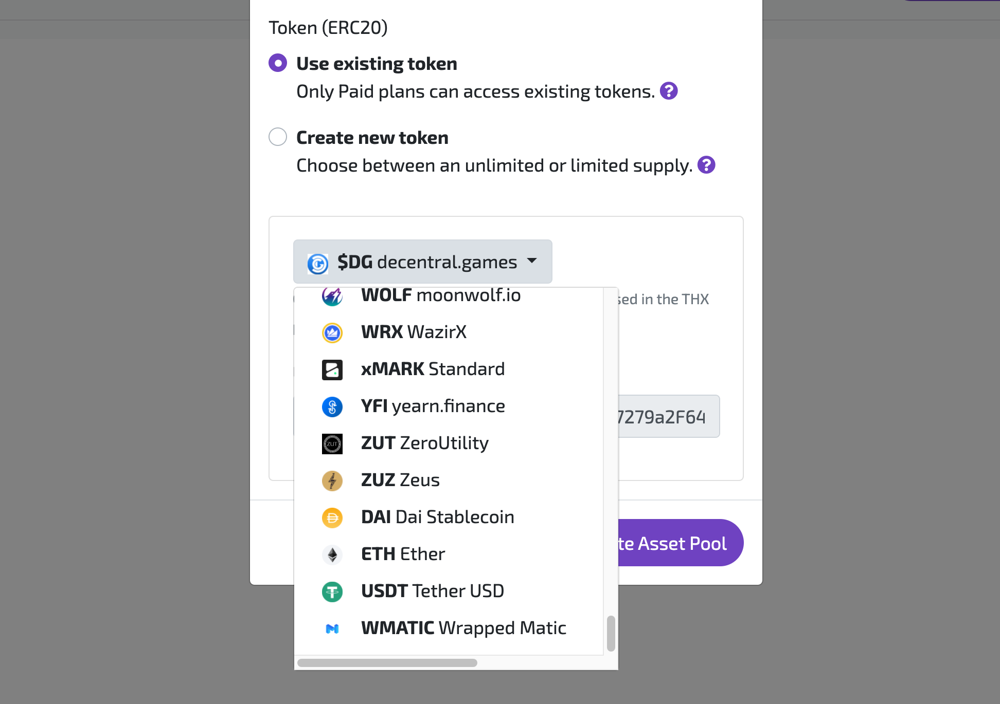
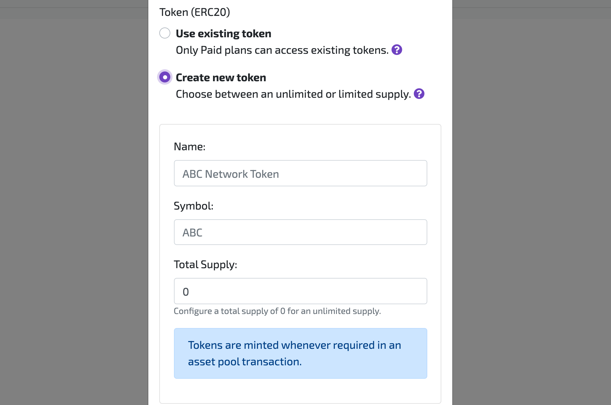
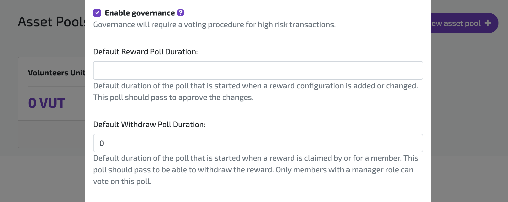

## 1. Create Asset Pool 

In [THX Dashboard](https://dashboard.thx.network) you can create an application to obtain client credentials and once yo have sone so, you will be able to create your pool and connect it to a token contract. You need to deploy a new pool if you want to switch to another token contract, so make sure to think about your token configuration carefully. 

### 1.1 ERC20 existing token contract

Paid accounts will be able to choose a token from the [Quickswap curated token list](https://unpkg.com/quickswap-default-token-list@1.0.55/build/quickswap-default.tokenlist.json). This is because the THX protocol swaps the deposit fees for THX to benefit its token holders. Tokens that are not on the list can not be swapped easilty and will therefor not be supported. 

### 1.2 ERC20 UnlimitedSupply token contract

All accounts are able to deploy an asset pool and connect a new ERC20 token contract. By setting a totalSupply of 0 you choose for an unlimited token supply. Tokens will be minted by the asset pool when an outgoing transfer is required. You don't have to worry about periodic deposits.

### 1.3 ERC20 LimitedSupply token contract

All accounts are able to deploy an asset pool and connect a new ERC20 token contract. By setting a totalSupply of any integer > 0 you choose for a limited token supply. The totalSupply of your token will be stored in the pool and decreased when rewards are handed out. Deposit tokens back into the pool to create a durable circular token economy.

:::info
**Limited Supply:** Tokens with a limited supply are considered scarce assets and have the potential to gain monetary value when publically traded.
:::

## 2. Asset Pool Governance

You can elevate the security of the assets in your pool by configuring governance for high risk pool interactions. You can do this by enabling governance for your asset pool. If you choose to automatically approve all polls, you disable governance. When finalizing a poll, the duration and vote counts will be ignored and the poll will automatically be approved.

This example will set the default Reward Poll Duration to **3 days** (`259200` seconds) and the default Withdraw Poll Duration to **7 days** (`604800` seconds). 

**Reward Poll Duration:** This is the duration of the poll started when a new rewards is configured for the pool or when a change is required for the size of an existing reward.

**Withdraw Poll Duration:** 
This is the duration of the poll started when a member has been given or claims a reward. Managers should approve the withdrawal before the poll ends to enable the member to withdraw the reward.
