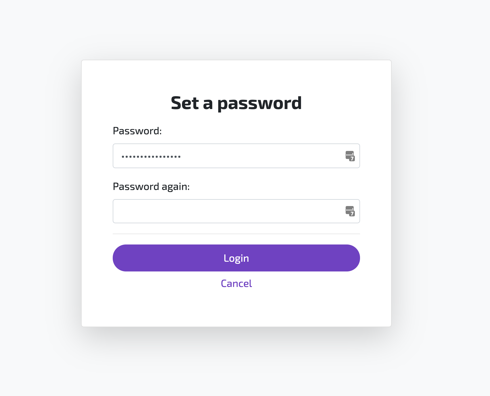

## 1. Account Signup

THX API provides a secury way to create a wallet for your users. It will generate a new private key and encrypt it with the `password` you provide in the request. The hash of this encrypted key will be stored in our Cloud databases and removed when the user has claimed ownership of the account and transferred the membership to a new address. The request will provide the account wallet address. You should store this and use it to transfer rewards to.

:::info
The AssetPool header is optional but if you provide it the new account is given the member role upon creation.
:::

**Request:**
```javascript
axios({
    url: 'https://api.thx.network/v1/account',
    method: 'POST',
    headers: {
        AssetPool: '0x278Ff6d33826D906070eE938CDc9788003749e93'
    },
    data: {
        email: "peter@thx.network",
        secret: "123456",
    }
})
```

**Response:**
```json
{
    "address": "0x278Ff6d33826D906070eE938CDc9788003749e93",
}
```

## 2. Account Activation

Accounts created for your users should be activated at some point to make sure that ownership of the private key is securely transferred to the end-user. You can do so by sending them a login link for THX Wallet. The link in the e-mail will redirect them to THX Wallet where they are forced to choose a password an reencrypt their temporary private key. 

[](../static/img/set_password.png)

When authenticated with THX Wallet a new private key will be provided to the account by our decentralized key distribution service. At this point both keys are known to the client and the assets pools member id will be updated with the new address. 

**Request:**
```javascript
axios({
    url: 'https://api.thx.network/v1/account/login',
    method: 'POST',
    data: {
        email: "peter@thx.network",
        password: "123456",
    }
})
```
