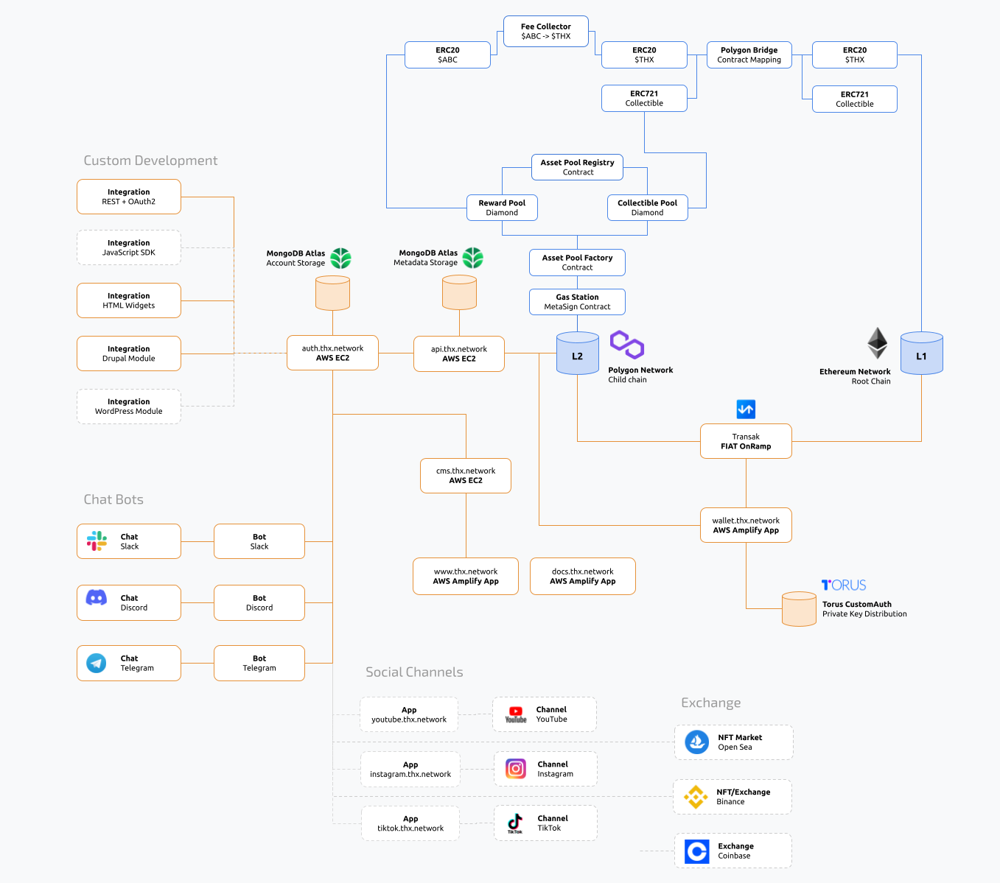

THX API uses layer 2 scaling solution [Polygon](https://www.polygon.technology) to be able to offer fast and cheap blockchain transactions. THX takes away the burdon of paying gas by relaying all contract state changing transactions to the API admin account which will be responsible for paying the networks gas fees in MATIC.

You can use the THX Web Wallet to move funds between layer 1 (Ethereum Main net) and 2 (Polygon Main net).

:::info
Your layer 1 address will be identical to your layer 2 address, so make sure to have some ETH availble in that account if you decide to move your assets to layer 1.
:::

## Network Configuration

| API | Network | Gas |
|:------------------------------|:------------------------|:------|
|https://api.thx.network        | [Polygon Mainnet](https://explorer-mainnet.maticvigil.com/)       | MATIC (relayed) |
|https://api.thx.network        | [Polygon Mumbai Testnet](https://explorer-mumbai.maticvigil.com/) | MATIC (relayed) |
|https://wallet.thx.network     | [Polygon Mainnet](https://explorer-mainnet.maticvigil.com/)       | MATIC (relayed) |
|https://wallet.thx.network     | [Ethereum Mainnet](https://etherscan.io/)                         | ETH   |

## Network Diagram

The THX ecosystem contains of various parts that help you embed fintech in your application without worrying about security, performance or scalability. A communications diagram is shown below. [Contact our team on Slack](https://thx.page.link/slack) for further questions about the network architecture.

