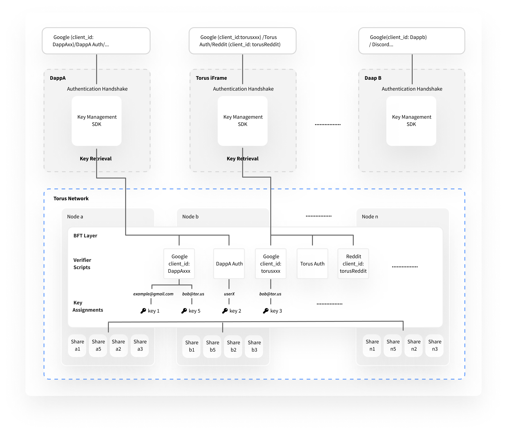

CustomAuth is used to directly interact with the [Torus Key Infrastructure](https://docs.tor.us/key-infrastructure/technical-architecture) to assign, store and retrieve keys on the network. CustomAuth implements an interaction flow as highlighted below. 

THX Wallet uses Torus CustomAuth to provide our users with private keys without having to store those private keys centralized in our cloud database or decentralized on the users device. With The Torus CustomAuth THX Wallet users only need remember tradtional e-mail password credentials for them to access their wallet.  

